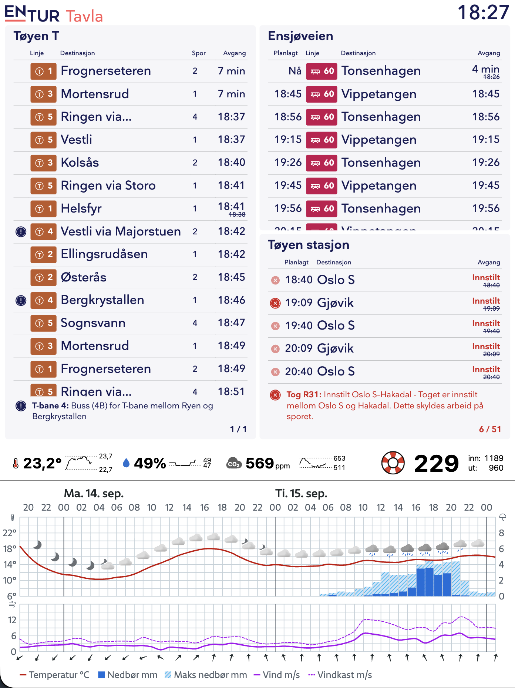

# Hjemmeskjerm

Status-skjerm til å ha i gangen hjemme. Skjermen viser en Entur-tavle, Netatmo-tall, antall
besøkende på Tøyenbadet og YR-data. Mye av koden er laget med Claude.



Prosjektet er delt i to:

| Mappe | Hva det er |
|---|---|
| [`webpage/`](webpage) | Selve nettsida. Vite, ren JavaScript, rendres i 1404×1872. |
| [`eink/`](eink) | Viser nettsida på e-paper-skjermen: et C-program som snakker med panelet, og en Python-løkke som gjør sida om til et bilde. |

Begge deler kjører på Raspberry Pi-en. Nettsida serveres lokalt, Python-løkka tar skjermbilde
av den hvert femte minutt og sender bildet til skjermen.

# Hardware

Jeg bruker følgende:
- [10.3 tommer e-paper skjerm med driver](https://www.waveshare.com/10.3inch-e-Paper-HAT.htm) (1404×1872 piksler)
- [Raspberry PI 3](https://www.raspberrypi.com/products/raspberry-pi-3-model-b/)

# Komme i gang

For å jobbe med nettsida, se [`webpage/README.md`](webpage/README.md):

```sh
cd webpage && pnpm install && pnpm dev --host
```

For å sette opp skjermen på Pi-en, se [`eink/README.md`](eink/README.md).
